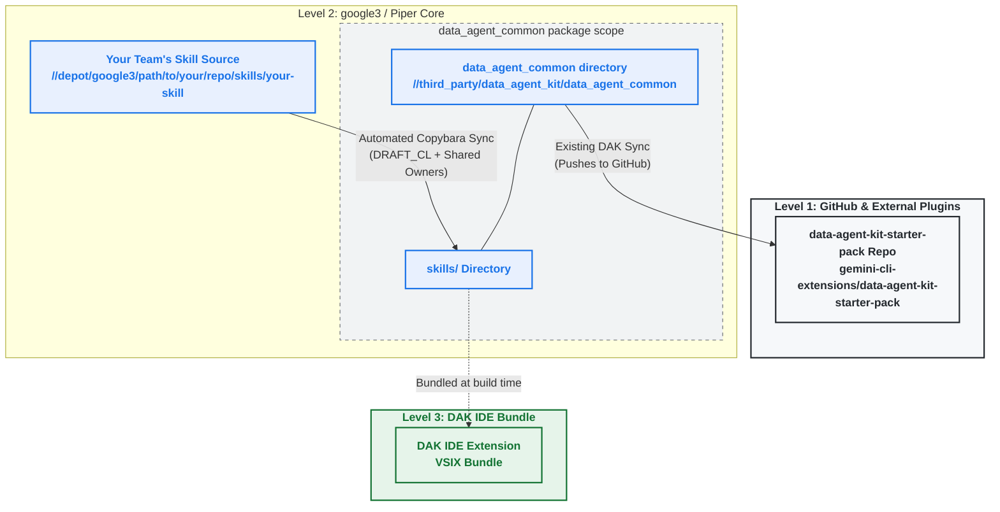

# Codelab: Onboarding Your Skill to the Data Agent Kit (DAK)

Welcome! This guide will help you integrate your team's domain-specific AI agent skills into the **Data Agent Kit (DAK)**. 

By following this guide, you will set up an automated, conflict-free sync from your repository to DAK. This setup uses a **Flat Structure** with **Shared Ownership**:
*   **Flat Structure**: Your skill will live at the top level of the DAK skills directory (e.g., `skills/{your-skill-name}/`). This ensures it is bundled cleanly into the IDE Extension (VSIX) and shipped to the public GitHub starter pack.
*   **Shared Ownership**: You sync your skill as a `DRAFT_CL` to `data_agent_common`. You maintain an `OWNERS` file in your skill folder, allowing you to self-approve and submit updates without being blocked by the DAK team.
*   **One-Time Registration**: When you first onboard a skill, you send a quick CL to register it in the DAK build graph. After that, all updates are 100% automated via Copybara.

---

## Instructions for AI Assistants (Agent-Friendly)

If you are an AI coding assistant (e.g., Jetski, Gemini, etc.) helping a developer onboard their skill, you can automate this process. Follow these steps:

### 1. Identify Variables
Ask the user or detect the following variables in the workspace:
*   `PARTNER_TEAM_NAME`: Human-readable name of the partner team (e.g., `GCS`).
*   `PARTNER_SKILL_NAME`: Folder name for the skill, using lowercase and underscores (e.g., `gcs_transfer`).
*   `PARTNER_MDB_GROUP`: The partner team's MDB group (e.g., `gcs-eng`).
*   `PARTNER_EMAIL`: The partner team's contact email (e.g., `gcs-team@google.com`).
*   `SOURCE_GP3_PATH`: The absolute google3 path to the partner's skill source (e.g., `google3/java/com/google/android/apps/gcs/agent/skills/gcs-transfer`).
*   `DAK_REVIEWERS`: List of DAK team LDAPs to add as reviewers. Default: `["ellurubharath", "snehamitshah", "girishduvuru"]`.

### 2. Automation Steps
1.  **Create Local `BUILD`**: Generate the `BUILD` file in the partner's source directory (see **Template A**).
2.  **Create Local `OWNERS`**: Generate the `OWNERS` file in the partner's source directory (see **Template B**).
3.  **Create `copy.bara.sky`**: Generate the Copybara config in the partner's source directory (see **Template C**).
4.  **Run Validation**: Run the local Copybara dry-run and blaze tests to verify.

---

## High-Level Architecture



---

## Templates

### Template A: Local `BUILD` File
Create this file at: `{SOURCE_GP3_PATH}/BUILD`
This defines your skill target. It will be copied to DAK along with your skill.

```python
load("//third_party/data_agent_kit/data_agent_common/internal:skill_defs.bzl", "agent_skill")

package(
    default_applicable_licenses = ["//third_party/data_agent_kit/data_agent_common:license"],
    default_visibility = ["//visibility:public"],
)

agent_skill(
    name = "{PARTNER_SKILL_NAME}",
    definition = "SKILL.md",
    resources = [
        # List all helper scripts, templates, or references here.
        # Paths must be relative to this directory.
        # e.g., "scripts/helper.py", "templates/config.json"
    ],
)
```

### Template B: Local `OWNERS` File
Create this file at: `{SOURCE_GP3_PATH}/OWNERS`
This allows your team to self-approve CLs in your skill folder. Do **not** add `set noparent` so the DAK team retains inherited visibility.

```text
# OWNERS for {PARTNER_TEAM_NAME} skill: {PARTNER_SKILL_NAME}
{PARTNER_MDB_GROUP}@google.com
```

### Template C: `copy.bara.sky`
Create this file at: `{SOURCE_GP3_PATH}/copy.bara.sky`
This syncs your skill directory to DAK.

> [!IMPORTANT]
> **Filename Constraint**: Copybara strictly enforces that the configuration file must be named exactly `copy.bara.sky`. Do **not** rename this file (e.g., for testing), or the Copybara CLI will fail with an error.

```python
"""Copybara configuration for syncing {PARTNER_TEAM_NAME} skill ({PARTNER_SKILL_NAME}) to DAK."""

SOURCE_PATH = "{SOURCE_GP3_PATH}"
DESTINATION_PATH = "google3/third_party/data_agent_kit/data_agent_common/skills/{PARTNER_SKILL_NAME}"

# Automatically injects/enforces DAK-required metadata in SKILL.md
def _inject_metadata(ctx):
    source_path = ctx.params["source_path"]
    skill_md_path = source_path + "/SKILL.md"
    
    content = ctx.read_path(ctx.new_path(skill_md_path))
    parts = content.split("---")
    if len(parts) < 3:
        return # No frontmatter, do nothing
        
    frontmatter = parts[1]
    lines = [l for l in frontmatter.split("\n")]
    
    has_license = False
    metadata_index = -1
    has_version = False
    has_publisher = False
    
    for i in range(len(lines)):
        line = lines[i]
        stripped = line.strip()
        
        if stripped.startswith("license:"):
            has_license = True
            lines[i] = "license: Apache-2.0"
        elif stripped.startswith("metadata:"):
            metadata_index = i
        elif stripped.startswith("version:") and metadata_index != -1:
            has_version = True
        elif stripped.startswith("publisher:") and metadata_index != -1:
            has_publisher = True
            indent = line.split("publisher:")[0]
            lines[i] = indent + "publisher: google"
            
    new_lines = []
    for i in range(len(lines)):
        new_lines.append(lines[i])
        if i == metadata_index:
            if not has_version:
                new_lines.append("  version: v1")
            if not has_publisher:
                new_lines.append("  publisher: google")
                
    if not has_license:
        new_lines.append("license: Apache-2.0")
        
    if metadata_index == -1:
        new_lines.append("metadata:")
        new_lines.append("  version: v1")
        new_lines.append("  publisher: google")
        
    parts[1] = "\n".join(new_lines)
    new_content = "---".join(parts)
    
    ctx.write_path(ctx.new_path(skill_md_path), new_content)

inject_metadata = core.dynamic_transform(
    impl = _inject_metadata,
    params = {"source_path": SOURCE_PATH},
)

core.workflow(
    name = "sync_to_data_agent",
    origin = piper.origin(),
    destination = piper.destination(
        # DRAFT_CL allows review. Since you have OWNERS in the destination,
        # you can self-approve.
        mode = "DRAFT_CL",
    ),
    # Sync everything except the Copybara config, BUILD files, and tests
    origin_files = glob(
        [SOURCE_PATH + "/**"],
        exclude = [
            SOURCE_PATH + "/copy.bara.sky",
            SOURCE_PATH + "/BUILD",
            SOURCE_PATH + "/**/BUILD",
            SOURCE_PATH + "/**/*_test.py",
            SOURCE_PATH + "/EVAL.txtpb", # Exclude evalin configs if present
        ],
    ),
    destination_files = glob([DESTINATION_PATH + "/**"]),
    authoring = authoring.overwrite("{PARTNER_TEAM_NAME} Team <no-reply@google.com>"),
    transformations = [
        inject_metadata,
        core.move(SOURCE_PATH, DESTINATION_PATH),
        # Patch Python imports if you have multiple files importing each other
        core.replace(
            before = "google3.{YOUR_SOURCE_PATH_WITH_DOTS}",
            after = "google3.third_party.data_agent_kit.data_agent_common.skills.{PARTNER_SKILL_NAME}",
        ),
        # Leakr check is required for all Piper-origin workflows to prevent leaks.
        leakr.check(),
    ],
)

# Register with Copybara-as-a-Service (CaaS)
# Use a unique migration name (e.g., by appending your skill name) to avoid clashes in CaaS
service.migration(
    migration_name = "sync_to_data_agent_{PARTNER_SKILL_NAME}",
    owner_mdb = "{PARTNER_MDB_GROUP}",
    contact_email = "{PARTNER_EMAIL}",
    state = "ACTIVE",
)
```

---

## Python Import Guidelines for Multi-File Skills

If your skill contains multiple Python files (e.g., helper scripts, libraries) that need to import each other, you must follow these guidelines to ensure compatibility with Google3 and portability to GitHub.

### The Recommended Pattern: `try-except` Imports

To allow your scripts to work seamlessly both in Google3 (using absolute imports) and on GitHub (using local imports), you should use a `try-except ImportError` block.

This pattern is highly recommended because it avoids any runtime path manipulation (`sys.path` hacks) and allows standard Google3 tooling to understand your import graph.

Example:
If your skill is named `my_skill` and has a helper module `helper.py` in its `scripts/` directory, write your imports like this:

```python
try:
  # Google3 absolute import (works in the monorepo)
  from google3.third_party.data_agent_kit.data_agent_common.skills.my_skill.scripts import helper
except ImportError:
  # GitHub/OSS local import fallback
  import helper
```

### Directory Naming: Underscores are Required in Google3

To support this import pattern, all skill directories in Google3 **must use underscores** (`_`) in their names (e.g., `my_skill`). This ensures that internal Python import paths (e.g., `from google3...import`) are syntactically valid.

**Automatic GitHub Translation**: 
When DAK syncs these skills to the public GitHub repository, the DAK Copybara workflow **automatically translates underscores to hyphens** (e.g., `my-skill`) for the public release, and translates them back on import. As a partner, you do **not** need to configure any renaming rules; it is handled globally by the DAK platform.


### No `BUILD` or Test Files in DAK

To keep the DAK repository clean and avoid any Bazel dependency conflicts, **do not copy your `BUILD` files or `*_test.py` files to DAK**. 

DAK defines all skill build rules centrally in the shared `third_party/data_agent_kit/data_agent_common/skills/BUILD` file. 

*   **Exclude them in Copybara**: Your `copy.bara.sky` (Template C) is configured to automatically exclude all `BUILD` and `*_test.py` files during the sync.
*   **Centralized Build Rule**: The DAK team (or you, during onboarding) will define a single `agent_skill` target in DAK's central `BUILD` file that globs your runtime scripts while ignoring tests.
*   **Independent Testing**: Your unit tests continue to run in your own repository (using your local `BUILD` rules), while DAK only runs its own automated integrity tests on the imported runtime assets.

---

## Step-by-Step Onboarding Flow

#### Step 1: Generate & Submit GCS-side Files
Apply **Template A**, **Template B**, and **Template C** to your local source directory. Replace all placeholders and **submit this CL** to your repository. This lands your Copybara config in the depot.

> [!NOTE]
> **Simplified SKILL.md**: Your `SKILL.md` frontmatter only needs to contain `name` and `description`. You can safely omit `license` and `metadata` (version/publisher) from your source file. The Copybara sync (Template C) will automatically inject the correct DAK defaults (`Apache-2.0`, `v1`, `google`) while preserving any other custom metadata you might have (like `tags` or `category`).

### Step 2: Request Safe Review Exemption
File a bug with the Copybara team at [go/copybara-bug](https://goto.google.com/copybara-bug) to bypass the Safe Review hold:
> **Title**: Safe Review Exemption for Piper-to-Piper sync: {PARTNER_SKILL_NAME}
>
> **Body**:
> Hi Copybara Team,
>
> We are setting up a Piper-to-Piper Copybara sync to onboard our skill into the Data Agent Kit.
>
> *   **Source**: {SOURCE_GP3_PATH}
> *   **Destination**: //depot/google3/third_party/data_agent_kit/data_agent_common/skills/{PARTNER_SKILL_NAME}
> *   **Config**: {SOURCE_GP3_PATH}/copy.bara.sky
> *   **Workflow**: sync_to_data_agent
>
> Since this is a purely internal Piper-to-Piper sync, we would like to request an exemption from the Safe Review process.
>
> Thanks!

### Step 3: Run Copybara & Submit the Import CL (Go Live!)
Once your GCS-side CL is submitted, run Copybara locally to import the files and create the Draft CL in DAK:

> [!IMPORTANT]
> **First-Time Sync**: Because this is the first time you are running this migration, Copybara needs to initialize its history. You **must** pass the `--force` flag on the first run. Subsequent runs will not need it.

```bash
copybara {SOURCE_GP3_PATH}/copy.bara.sky sync_to_data_agent --force
```

This will create a Draft CL in DAK containing your runtime files under the `skills/{PARTNER_SKILL_NAME}` directory.

#### **Zero-Touch Activation**:
Thanks to DAK's **Auto-Discovery** engine:
1.  Your skill is **automatically defined and registered** in DAK's build system as soon as the files land in the `skills/` directory.
2.  **You do not need to make any manual edits to DAK's `BUILD` files.**
3.  Simply open the Draft CL created by Copybara, verify that the files look correct, and run the DAK integrity tests to verify:
    ```bash
    blaze test //third_party/data_agent_kit/data_agent_common/skills/...
    ```
4.  **Submit the Draft CL.** Your skill is now active and will be bundled into the next VSIX build!

> [!NOTE]
> Once this initial import CL is merged, all future updates to your skill's code, resources, and metadata are 100% automated via Copybara. Every time you submit in your repo, CaaS will create a draft CL in DAK that you can self-approve. You never have to touch DAK configs again.
